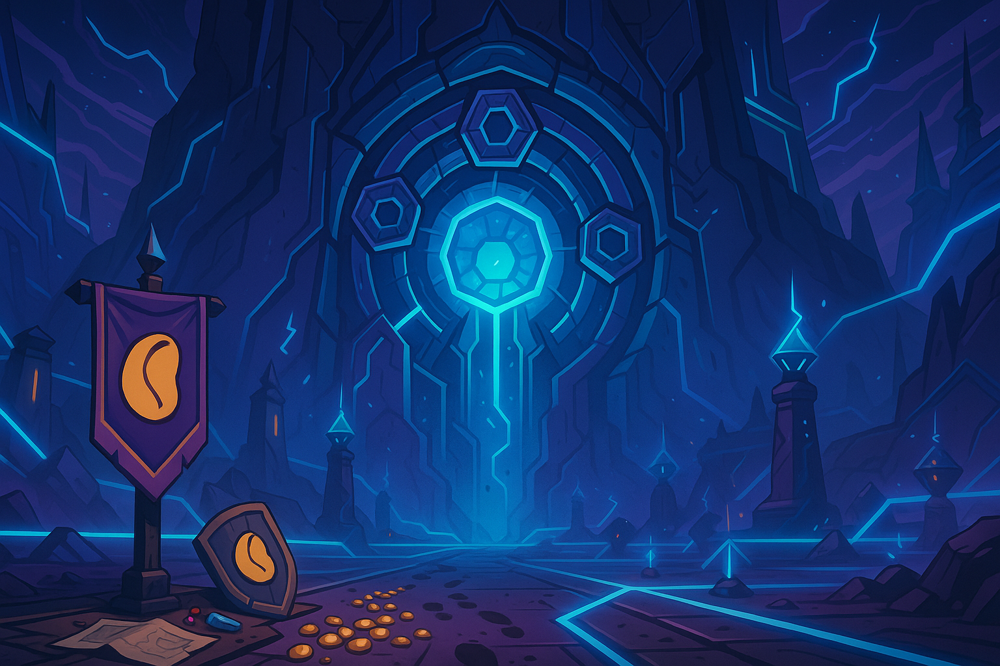

# Bean Raid Chronicle

## Welcome to the Epic Gaming Adventure

Join us on an extraordinary journey through the Bean Raid chronicles, where epic battles, legendary loot, and unforgettable moments await.

## Raid Videos

### [Week 1 — 8/17 — Pilot: Beans Before Keys](pages/week1/week1.html)

 [Episode 1](https://www.youtube.com/watch?v=b35HsGLHsNE)

We debut in Omega Manaforge with the Bean Ethos: if it isn't beans, it's garnish. The raid chooses beans and keys over the sanctity of main raid.

### [Week 2 — 8/24 — Beans vs. Beams](pages/week2/week2.html)
Back in Omega Manaforge with new faces and full confidence. Normal falls like dominos, then Heroic Plexus Sentinel introduces us to geometry.

### [Week 3 — 8/31 — Beans on the Brink](pages/week3/week3.html)
Confidence restored after geometry lessons, we march back into Heroic Plexus Sentinel. Beans > beams, confirmed.

### [Week 4 — 9/7 — Rosterboss wins](pages/week4/week4.html)
Sunday night brings the skeleton crew special: seven brave souls answer the call to beans, while the rest of the guild nurses hangovers or discovers the wonders of touching grass. The raid logs in to face their deadliest foe yet: **Rosterboss**.

### [Week 5 — 9/14 — Beans Beyond the Wall](pages/week5/week5.html)
After Week 4’s skeleton crew flop and Week 3’s purple rave wall, the beans returned to Manaforge Omega with one goal: push past Forgeweaver Araz and finally taste the sweet legumes of mid-tier victory. The roster was stacked, the vibes were strong, and even when Arcanobussy tried to hearth to safety, the beans dragged him back into service. This was the night the wall would fall.

### [Week 6 — 9/21 — Raider Vacation](fake_address)
No raid this week

### [Week 7 — 9/28 — Beans of Curve](pages/week7/week7.html)

Somehow the beans shuffled back into Manaforge Omega this week with the smug glow of a team that “definitely” hadn’t already finished the raid. Attendance was suspiciously full, as if everyone wanted to leech off a certain unspoken success. Like Marilyn Monroe once said: *“If you can’t handle me at my worst pull, you don’t deserve me at my AOTBean.”*

### [Week 8 — 10/5 — Beans of Our Gays](pages/week8/week8.html)

Fresh trial Ajjaxx, Elemental Shaman and alleged friend of Linny, materializes in raid. Panda, suffering from catastrophic memory failure, doesn't recognize his own plus-one. Panic spreads. "Who is this shaman? Did someone sneak in from LFG?" Cham's boot is swift. Ajjaxx's parting message in /say: a declaration of our collective homosexuality. Discord rage-quit commences. We invite him back. Gay jokes flow like lava burst procs for the remainder of the evening. Good times. Guy is definitely banned for life though—we don't deal with that kind of cringe.

### [Week 9 - 10/12 - Beans in the Steam](pages/week9/week9.html)
Raid night begins fashionably late, because apparently punctuality is an optional buff. **Cole** assures us reinforcements are coming — “I’ve got some friends joining.” Moments later, in strolls **Riley**, a fresh-out-the-box dragon with an item level so low it counts as a charity case. Spirits are… tepid.

### [Week 10 — 10/19 — Fellowship of Beans](pages/week10/week10.html)
The only reason anyone logged in tonight? **Fellowship was down for maintenance.** Bereft of their new obsession, the crew stumbled back into **Manaforge Omega** like exiles returning to the bean fields. Thus began the reluctant epic: *Fellowship of Beans.*