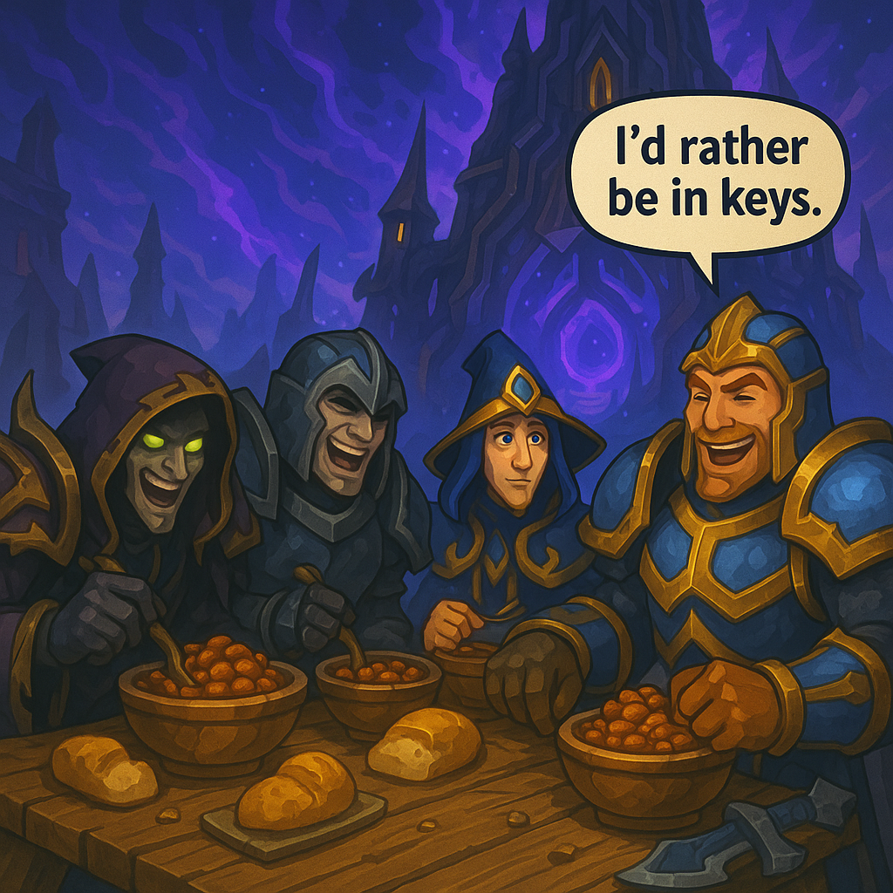
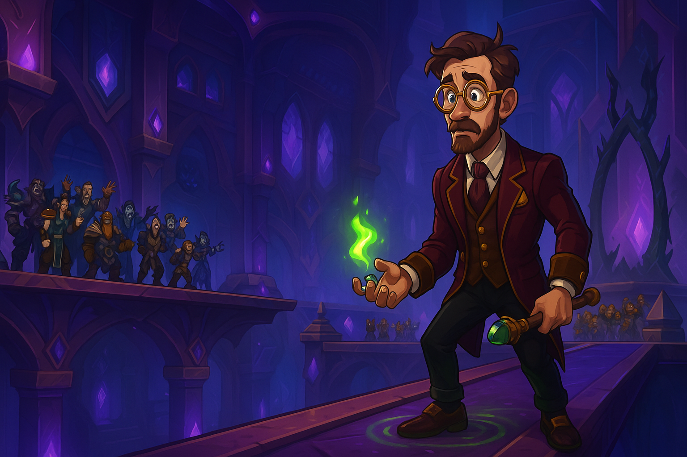

# Week 1 — 8/17 — Pilot: Beans Before Keys

**Episode Banner:**

**Cold Open:** We debut in **Omega Manaforge** to the sound of grumbling: *“I’d rather be in keys.”* The Bean Ethos is established: if it isn’t beans, it’s garnish.

**Highlights:**

* Cast rolls in: **beartastic** (a lowly druid), **shadobe** (DPS/healing shaman; mortal enemy: shedebe), **bigddbezos** (warlock, currently cloakless), **udderbitter** (warrior), **kez** (tank), and **a panda** (mysterious, adorable, probably dangerous).
* Raid chooses beans and keys over the sanctity of main raid. Spirits high; sodium higher.
* **bigddbezos** cannot traverse critical gaps without a cloak; raid performs emergency bean‑powered portage.

  
* We shoulder, summon, and scoot our way to **Dimensius**. Pre-final pull: **bigddbezos** burns the only B‑Rez, producing a legendary wipe. Next pull: clean execution—**Dimensius (Normal) down**.
* **beartastic** repeatedly "bark skins" **shadobe** even when absolutely nothing is happening; shaman remains the safest being in Omega.

**Wipe of the Week:** *"The Flightless Warlock" (Genus: Lack‑of‑Cloak‑icus). Habitat: manaforge catwalks. Behavior: meeps, requests summons, is carried like premium luggage.*

**Honorable Mention:** The Dimensius B‑Rez Incident — **bigddbezos** spent the only battle res and the cosmos laughed; the real kill happened on the next pull.

**Quotes Out of Context:**

* “I’d rather be in keys.” — everyone, at once
* “Beans are a performance‑enhancing… vegetable?” — someone with 3 stacks of spice debuff
* “Anyone got a cloak? Asking for a Bezos.” — raid chat

**Mini‑Awards:**

* **Golden Ladle (carry of the night):** **Kez**, for tank‑muling and morale.
* **Refried Wipes (most deaths, still smiling):** **bigddbezos**, grounded hero.
* **Chili‑Con‑Carry (biggest clutch):** The **summon squad**, for repeated rescues.
* **Spilled Beans (funniest reveal):** We officially prefer **beans** to any other food.

**Lessons Learned (3 max):**

1. Bring a cloak. Beans are not a mobility cooldown.
2. Keys discourse fuels DPS but not footwork.
3. Dimensius falls to teamwork (and legumes).

**TL;DR:** First footsteps in Omega; beans > food, keys > decorum, **Dimensius (Normal) down** with one very portable warlock.

---
