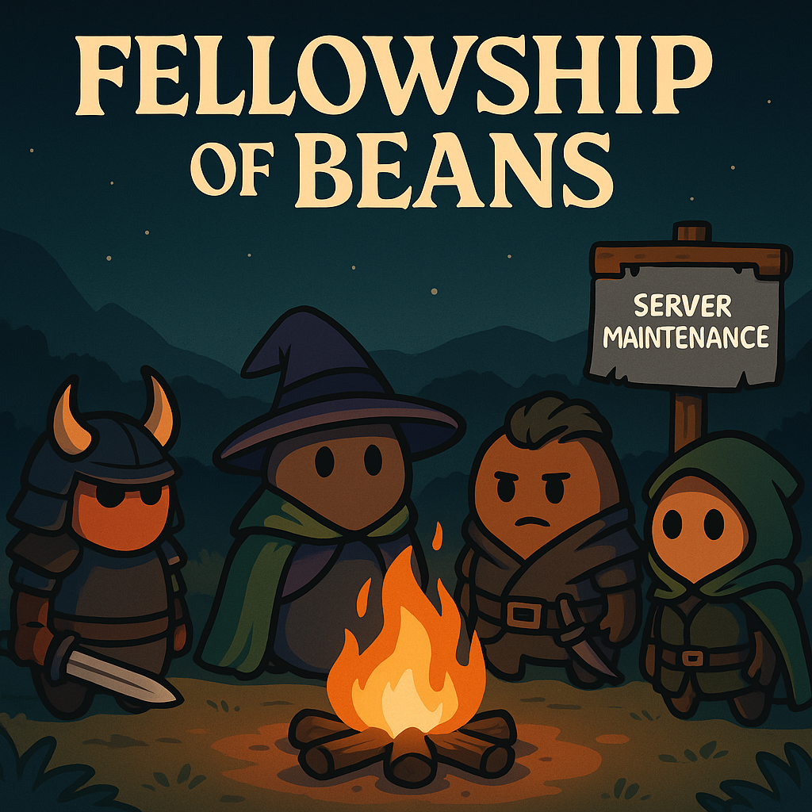

### Week 10 — 10/19 — **Fellowship of Beans**

**Episode Banner:**

**Cold Open:**
The only reason anyone logged in tonight? **Fellowship was down for maintenance.** Bereft of their new obsession, the crew stumbled back into **Manaforge Omega** like exiles returning to the bean fields. Thus began the reluctant epic: *Fellowship of Beans.*

**Highlights:**

* **The Fellowship Fails:** With their “real game” offline, the Beans begrudgingly remember how to raid. Spirits low, sarcasm high.
* **Oni Appears:** A wild Oni materializes — says nothing, pulls everything, and radiates pure **beansness**. Not a single syllable, just silent destruction.
* **Kez’s Equipment Failure:** Declares he can’t raid because his **monitor arm broke.** The excuse is so flimsy it gains instant meme status.
* **Mint’s Defensive Philosophy:** Accidentally **unbinds Cloak of Shadows** and bravely redefines “raw dog tanking” as a lifestyle choice.
* **Nexus King Chaos:** Both **udderbiter** and **Carl** perish mid-fight. The raid *slides* across the finish line, bean-greased and barely alive.
* **Dimensius Finale:** Final pull of the night — expectations low, caffeine gone — and somehow, **Dimensius dies.** Fellowship restored.

**Quotes Out of Context:**

* “We’re only here because Fellowship isn’t.”
* “He’s been silent the entire raid.” — everyone, about Oni
* “Monitor arm broke” — Kez, 2025’s most fragile tank
* “Cloak of Shadows was… optional.” — Mint, right before dying
* “No tanks, no hope, no problem.” — the raid, moments before the kill

**Mini-Awards:**

* **Golden Ladle:** **Oni**, for deadly silence and flawless execution.
* **Chili-Con-Carry:** **DPS Squad**, for skating through a tankless Nexus King.
* **Spilled Beans:** **Kez**, slain by IKEA.
* **Refried Wipes:** **Mint**, for embracing danger *and* death macros.

**Lessons Learned (3 max):**

1. When Fellowship is down, the Beans rise.
2. Hardware failure > moral failure.
3. Dimensius fears maintenance downtime.

**TL;DR:** Fellowship’s servers died, so the Beans lived. Oni said nothing, Kez lost a monitor, Mint lost his cloak, and the raid lost both tanks — but somehow, victory. Maintenance complete.
