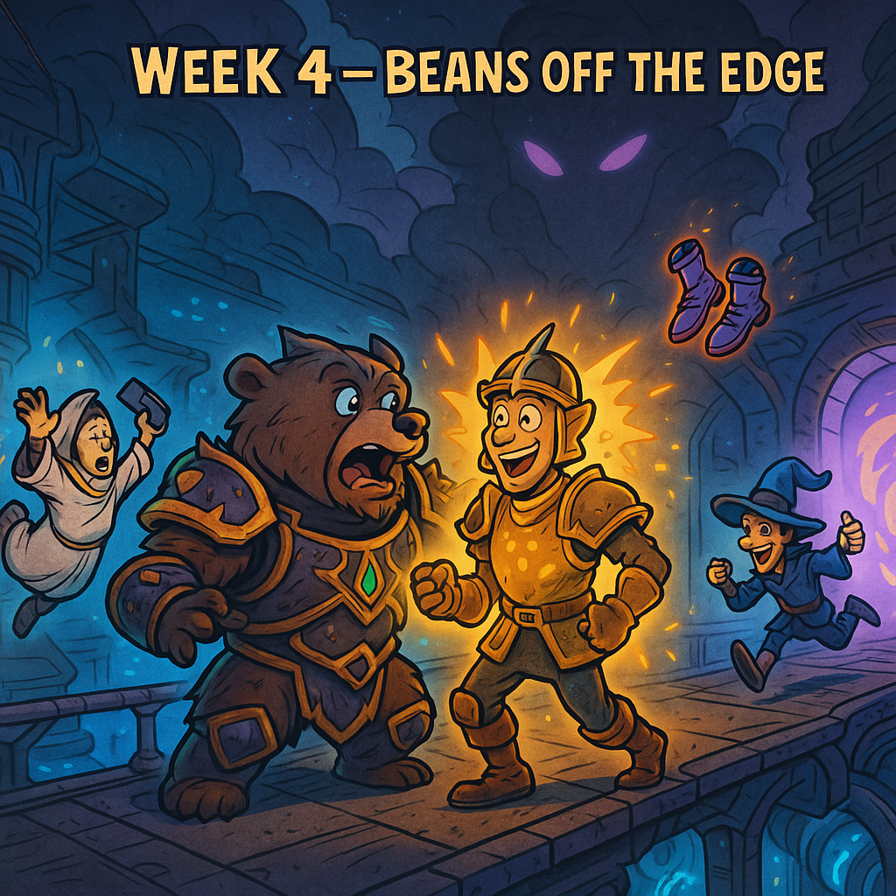

### Week 12 — 10/26 — **Beans Off the Edge**

**Episode Banner:**

**Cold Open:**
Raid opens with confusion: **Strut** strolls in on a **paper-geared tank**, somehow ripping threat off our **fully mythic-clad Carl Langdon**. The logs don’t lie, but physics might. The Beans begin to suspect witchcraft—or worse, main-raid gear funneling. Keith Brugg wasn’t in the raid, but he was everywhere, our minds, our fears. Who is that son-of-a-bitch?

**Highlights:**

* **Priest** checks their phone mid-pull, testing the *terminal velocity of faith*.
* **Soulhunter:** wipe caused by catastrophic DPS imbalance—one side brought firepower, the other brought vibes.
* **Stargazer:** performs the **Boot Scoot Boogie**, looting the boots off soulhunters then immediately scooting.
* **Dober:** goes on a **die-fest**, repeatedly falling off the platform. The Beans consider installing guard rails.
* **Dimensius:** down in three pulls—proof that even chaos can be efficient.
* **Kez:** absent, citing *“touching grass”* and *“reconnecting with sunlight.”* Raid unanimously agrees this is a sign of weakness.

**Quotes Out of Context:**

* “How is *he* pulling threat?”
* “Wait, was that the priest or their phone that fell?”
* “Soulhunter’s balanced—just not the raid.”
* “Boot! Scoot! Dodge!”

**Mini-Awards:**

* **Golden Ladle:** **Stargazer**, for dancing with death (and Soulhunter).
* **Refried Wipes:** **Dober**, for pioneering the art of falling with style.
* **Spilled Beans:** **Strut**, for breaking the laws of aggro and gear score.
* **Chili-Con-Carry:** **PriestPhone**, for achieving true enlightenment—at terminal velocity.

**Lessons Learned (3 max):**

1. Threat meters lie, but Strut doesn’t.
2. Gravity is undefeated.
3. Touching grass is not a raid cooldown.

**TL;DR:**
Beans fall, Strut ascends, and Dimensius falls faster. One priest, one mystery tank, and one hell of a night.
