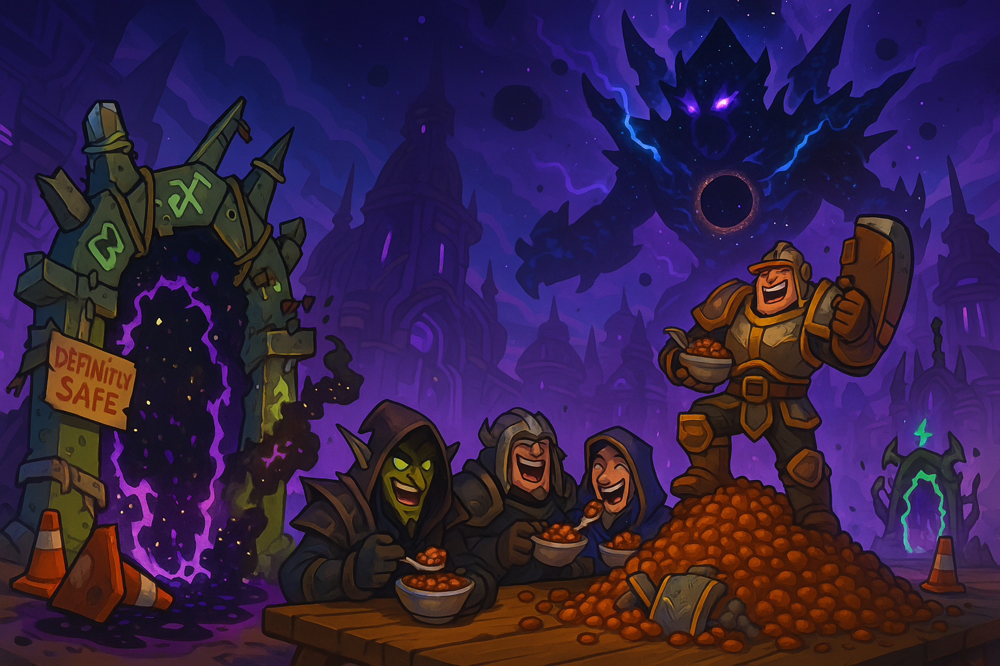
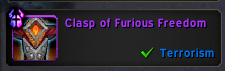
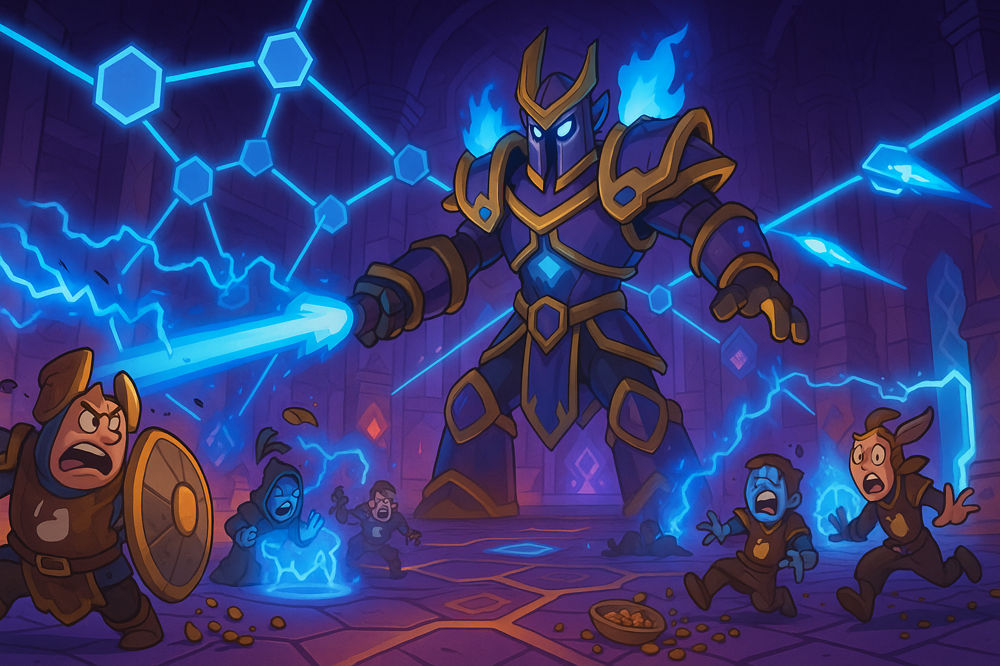

# Week 2 — 8/24 — Beans vs. Beams

**Episode Banner:**

**Cold Open:** We swagger back into **Omega Manaforge** with two new faces and a full bowl of confidence. Normal falls like dominos. Then **Heroic Plexus Sentinel** introduces us to geometry.

**Highlights:**

* New recruits: **Craigstone** (DK) and **Terrorism** (shaman). 
* Also joined: **kirim** (hunter), bravely raiding under a lingering **Taco Bell** debuff.
* **Cameo:** **Strut** (main‑raid RL) arrives piloting this week’s **rat ult**; precise callouts provoke **udderbitter** eruptions on schedule.
* **Normal clear:** smooth as refried butter.
* **Heroic wall:** **Plexus Sentinel** draws blue lines, we draw blanks.
* **Loot:** **Terrorism** snags the belt **“Clasp of Furious Freedom.”** 
* 
* **Kez** gets roasted for not being in Defensive Stance, officially rebranded as **Bean Stance™**.
* **Healers in the blender:** **Beartastic** and **Shadobe** pour everything into the  pot and still watch health evaporate. *“We’ll get them next week.”*
* **Suspect warlock gates** continue their reign of mild chaos.

**Quotes Out of Context:**

* “Bean Stance or Bust.” — someone, at Kez
* “Who placed that gate?” — everyone, every pull
* “Taco Bell is a DoT, not a buff.” — kirim’s digestive tract

**Mini‑Awards:**

* **Golden Ladle:** **Beartastic & Shadobe**, for heroic triage.
* **Chili‑Con‑Carry:** **Craigstone**, for grip‑saves and general menace.
* **Spilled Beans:** **Terrorism’s Freedom Belt**, instantly becoming a meme.
* 🌮 **Bean Digestif (guts of steel):** **kirim**, survived the Chalupa affix.

**Lessons Learned (3 max):**

1. The lattice does not care about our feelings.
2. Bean Stance is a state of mind.
3. Next week: more personals, cleaner soaks, fewer gates to Narnia.

**TL;DR:** Normal speedrun, heroic roadblock: **Plexus Sentinel**. Morale high, beans higher.

