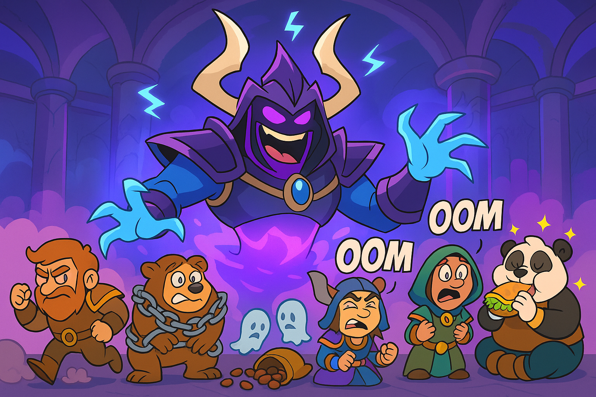

### Week 3 — 8/31 — **Beans on the Brink**

**Episode Banner:**

**Cold Open:**
Confidence restored after last week's geometry lessons, the beans march back into **Heroic Plexus Sentinel**.
First pull? We make it *all the way* to the wire before wiping. Second pull? Down goes the lattice lord.
Beans > beams, confirmed.

**Highlights:**

* **Plexus Sentinel:** First pull late wipe, second pull clean kill. The lattice has finally been beaned.
* **Second boss:** Took a while (positioning? personals? snacks?), but we clapped it in one go.
* **Trash drama:** With **jayohn** and **frintmesh** out, botched **shroud skips** became the new comedy routine.
  The spirit of scuffed gates lives on.
* **Loom'ithar:** One-shot, though **beartastic** soaked like a squirrel in traffic.
* **Forgeweaver Araz:** Pull one… tank **whiteboe** rage-quits. Emergency scramble.
* **Attendance roulette:** Half the roster has “emergencies” suspiciously aligned with raid time.
* **Small Beans (low ilvl)** culled: **Healari**, **Banahon**, **Terrorism** benched. Farewell, little legumes.
* **Extended break:** We waited 25 minutes for **panda** to conquer a honey ranch wrap from Angie's Grill.
  Truly a boss-level snack.
* **Progression wall:** 10% wipe to enrage, morale intact. **We vantus now.**

**Quotes Out of Context:**

* “Who shrouds like that?” — everyone, watching the skip collapse
* “It’s not a soak, it’s an interpretive dance.” — on Beartastic
* “We lost a tank… we lost a tank… oh, he quit.” — raid comms
* “The honey ranch wrap was worth it.” — panda, allegedly

**Mini-Awards:**

* **Golden Ladle:** **Plexus Kill Squad**, for showing beams can be beaned.
* **Chili-Con-Carry:** **panda**, for defeating Angie’s Grill mid-raid.
* **Spilled Beans:** **whiteboe**, rage-quit tank moment.
* **Refried Wipes:** the 10% enrage — so close, yet so bean.

**Lessons Learned (3 max):**

1. Vantus early, not late.
2. Shroud skips are just scuffed gates in disguise.
3. Never underestimate a honey ranch wrap.

**Boss Roast — Forgeweaver Araz:**
Araz is less a boss and more a rave turned sentient. His face is a smug purple void, his helmet a coat rack accident,
and his body dissolves into vape smoke because legs are for mortals. Every inch of him glows violet like he mugged
an amethyst mine, and his spectral claws exist purely to slap Beans back into the grave. To us, he's not
"Forgeweaver Araz" — he's **The Wall™**, the purple rave dad who reminds us that progression is pain.

**TL;DR:** Plexus down, Loomithar down, Araz attempted. Lost a tank, lost some small beans, lost 25 minutes to ranch,
but morale high. Progress made. Beans endure.
