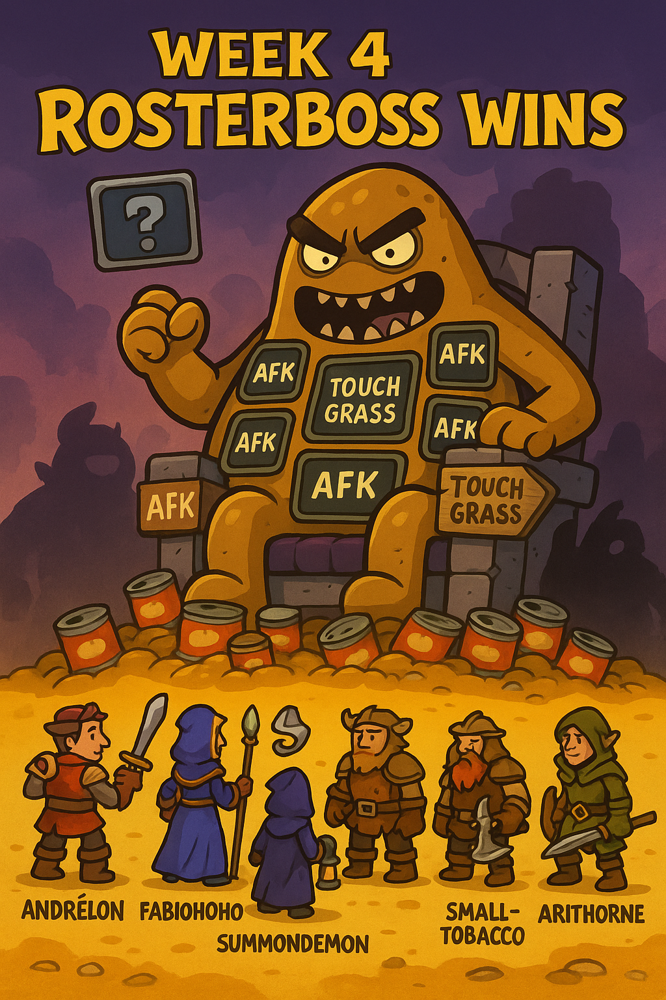

### Week 4 — 9/7 — **Rosterboss Wins**

**Episode Banner:**

**Cold Open:**
Sunday night brings the skeleton crew special: seven brave souls answer the call to beans, while the rest of the guild nurses hangovers or discovers the wonders of touching grass. The raid logs in to face their deadliest foe yet: **Rosterboss**.

**Highlights:**

* **Rosterboss takes the night:** Andrelon, Fabiohohoho, Summondemon, Udderbiter, Smalltobacco, and Arithorne stand tall, but seven beans do not a raid make. Even the rumored **Cole the 1-Eyed Cyclops** failed to materialize from his cave, leaving the beans empty-handed.
* **Forgeweaver Araz nerfed (non-Mythic)** — Blizzard confirmed hotfix tuning, making progression less punishing. Beans may now stand a slightly better chance against Purple Rave Dad.
* **Araz nerfs feel personally aimed at Bean Raid** — every single change matched our pain points. It’s almost like Blizzard was spectating our wipes.
* **Nexus-King Salhadaar pre-nerfed** — Blizzard swung the bat *before* we even pulled, saving Beans the trouble.
* **Kez wipe-call redemption:** In the chaos of a previous fight, Kez called a wipe early… and then the raid proceeded to **kill the boss on that same pull.** Legendary foot-in-mouth moment.

**Quotes Out of Context:**

* “Seven souls does not a raid make.” — everyone, simultaneously
* “Any loot would be tainted with incompleteness.” — Fabiohohoho, philosopher of beans
* “Perhaps the real beans were the friends we couldn’t gather.” — Summondemon
* “Rosterboss cannot be tanked.” — Kez

**Mini-Awards:**

* **Golden Ladle:** **Kez**, for calling a wipe into a kill. Sometimes prophecy is wrong in the best way.
* **Spilled Beans:** **Rosterboss**, the night’s true victor.
* **Refried Wipes:** The empty raid night itself — technically no wipes, but emotionally, infinite.
* **Chili-Con-Carry:** The skeleton crew, for showing up ready to bean despite overwhelming odds.

**Lessons Learned (3 max):**

1. Sometimes Blizzard nerfs the boss *for you*.
2. If you wipe loud enough, Blizzard listens.
3. Sometimes Blizzard nerfs the boss *before you even get there.*
4. (Bonus) Rosterboss cannot be defeated with seven beans.

**TL;DR:** Week 4 was less raid and more tragedy: Blizzard nerfed bosses across the board, but Bean Raid was nerfed harder by Rosterboss. Seven beans showed up, but Omega stayed undefeated. The beans will have to wait another day.

