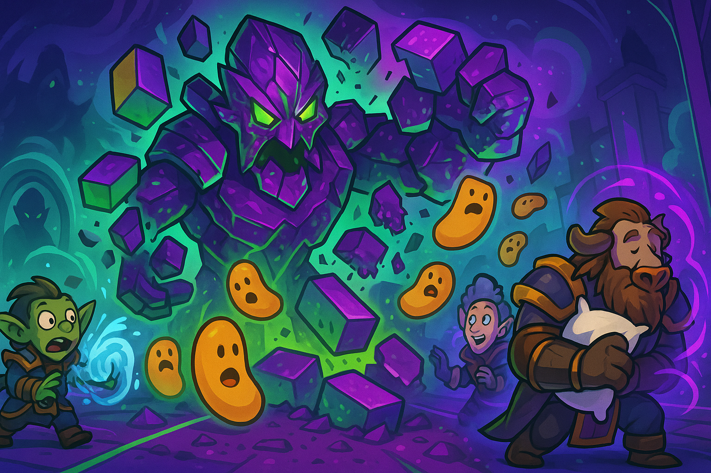

### Week 5 — 9/14 — **Beans Beyond the Wall**

**Episode Banner:**

**Cold Open:**
After **Week 4’s skeleton crew flop** and **Week 3’s purple rave wall**, the beans returned to Manaforge Omega with one goal: push past **Forgeweaver Araz** and finally taste the sweet legumes of mid-tier victory. The roster was stacked, the vibes were strong, and even when **Arcanobussy** tried to hearth to safety, the beans dragged him back into service. This was the night the wall would fall.

**Highlights:**

* **Roster shakeup:** Strut benched his usual Rat Ult pipeline and instead loaned out a **demon hunter**. **Kez** reclaimed the main tank role — fresh from a nap, rebranded as the **Coma Tank™** — replacing Strut’s weekly roulette with forklift consistency.
* **Arcanobussy** nearly made Week 1’s “Flightless Warlock” look subtle by hearthstoning mid-raid, only to be summoned back. Escape is futile. The beans always collect.
* **Shadobe** downgraded to **small bean** status, a reverse evolution that puts him in league with Week 3’s benched legumes. Gear or perish.
* **Forgeweaver Araz:** Week 3’s dreaded Wall™ became Week 5’s warm-up. After a couple messy pulls, the beans shifted cooldowns, moved Lust to on-pull, and sent purple rave dad back to the amethyst mine he crawled out of. Beans > vape clouds.
* **Soul Hunters:** One-shot. Three overdramatic demon hunters threw everything at once — void puddles, Hunt choreography, soul-fragment angst — only to be out-performed by a bean ensemble. Every Hunt line became a bean conga, every puddle soaked like spilled bean juice, every Spirit Bomb fizzled. Bonus irony: Strut’s borrowed demon hunter watched their cousins get clowned instantly.
* **Fractillus:** Should’ve been a one-shot, but first pull collapsed into a **burned bean moment** when Tetris lanes imploded like Week 2’s Chalupa DoT or Week 3’s ranch wrap delay. Second pull: walls sorted, soufflé saved, boss folded.

**Notable New Appearances:**

* **Moondog**: Showed up with **double healer specs** (Mistweaver monk and Resto druid), flexing like a healer buffet. Tossed out tea and roots in equal measure, proving to be a one-bean healer hydra — cut off one spec, two more grow back.

**Notable Absences:**

* **One-eyed Cole**: Still no sign of him. At this point, he’s less of a raider and more of a cryptid, whispered about like Azeroth’s Bigfoot. His eventual return may spark a server-wide event.
* **Beartastic**: Late because of football, with strong suspicions of tailgate chili betrayal. Protecting Shadobe with barkskins is one thing, but abandoning beans for bean chili is another level of treason.
* **Terrorism**: Still benched for **geometry war crimes** during Week 2’s Plexus Sentinel fiasco. Until the lattice forgives him, he remains exiled to off-screen limbo.

**Notable Wipe:**

* **Soulbinder wipe**: A failed boss reset combined with **Ex deciding it was AFK o’clock**. The result? A faceplant worthy of the Bean Raid archives, standing proudly beside Week 1’s Flightless Warlock and Week 3’s Ranch Wrap Delay.

**Wipe of the Week:**
*“The Soulbinder Reset Incident” (Genus: **AFK-icus Exitus**). Habitat: boss rooms where you really shouldn’t AFK. Behavior: raid attempts a reset, one player forgets to move, and the boss decides it’s dinner time. Result: beans scattered, healers screaming, raid chat dissolving into laughter and despair.*

*Honorable Mention:* **Ex’s AFK Mystery** — No one knows where he went. Bathroom? Snack run? Existential crisis? All we know is the beans paid the price.

**Quotes Out of Context:**

* “Press F to Wake Tank.”
* “It’s not a wipe, it’s avant-garde bean Tetris.”
* “Arcanobussy has left the raid… wait, summon him back.”
* “At least it wasn’t a shroud skip.”

**Mini-Awards:**

* 💤 **Golden Pillow (Kez):** For tanking straight out of a nap. (The Bean Stance™ evolves.)
* 🥄 **Golden Ladle:** Cooldown coordination squad for finally beaning Araz.
* 🌶️ **Chili-Con-Carry:** The raid solving Fractillus’s Tetris puzzle on pull two.
* 🫘 **Spilled Beans — Flightless Mage Edition:** **Arcanobussy**, for the hearth-and-return arc — Bezos’s legacy lives on.
* ♻️ **Refried Wipes:** Pre-optimization Araz pulls, joining Week 1’s B-Rez fail and Week 3’s 10% enrage in the hall of bean shame.
* 🧀 **Cheese Grater (Strut Legacy):** For providing this week’s demon hunter cameo and keeping the Rat Ult spirit alive.
* 🌿 **Bean Sprout Award:** **Moondog**, for sprouting into the raid as a double-healer hydra and keeping beans upright.
* ⏰ **AFK Chili Award:** **Ex**, for perfecting the art of leaving the raid at the worst possible time.

**Lessons Learned:**

1. Lust belongs on pull, not on vibes (see also: Week 3’s late vantus).
2. Tetris walls are fragile — treat them like soufflés (unlike kirim’s Chalupa, which remains indestructible).
3. Tanks nap, beans endure. Portable warlock, portable forklift.

**TL;DR:**
The beans finally breached the wall: Araz down, Soul Hunters one-shot, Fractillus beaned. With Moondog sprouting heals, Cole still mythic, Beartastic betraying beans for chili, Terrorism exiled by geometry, and Ex pioneering AFK science, Week 5 was peak Bean Raid — chaos, comedy, and legumes conquering progression.
