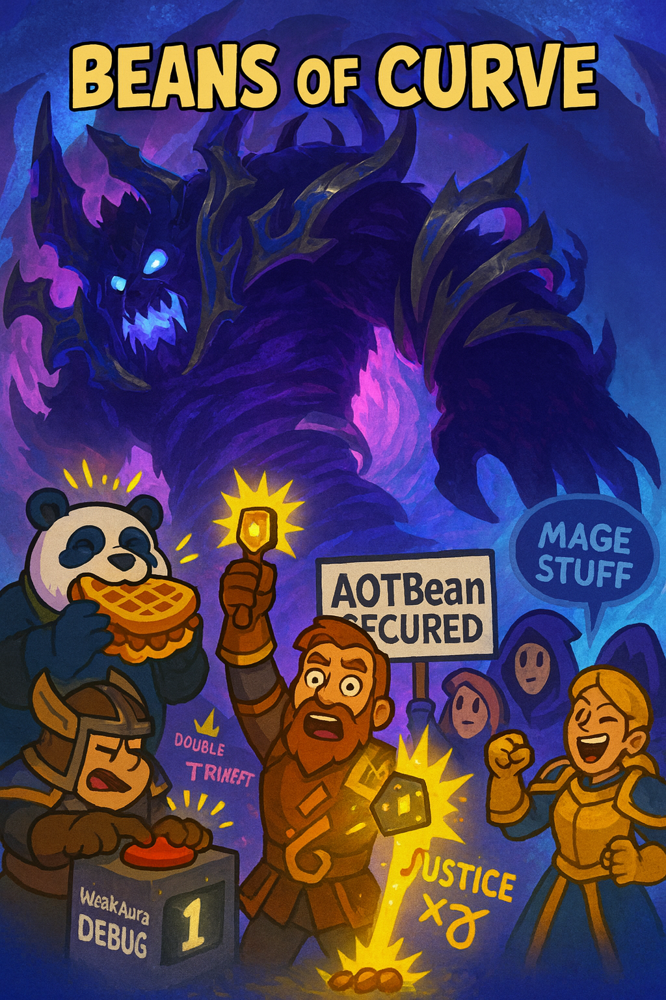

### Week 7 — 9/28 — **Beans of Curve**

**Episode Banner:**

**Cold Open:**
Somehow the beans shuffled back into Manaforge Omega this week with the smug glow of a team that “definitely” hadn’t already finished the raid. Attendance was suspiciously full, as if everyone wanted to leech off a certain unspoken success. Like Marilyn Monroe once said: *“If you can’t handle me at my worst pull, you don’t deserve me at my AOTBean.”*

**Highlights:**

* Pre-raid ritual: **panda** powered up with a chicken-and-waffle sandwich, instantly achieving +10% crit but −50% mobility.
* **Sentinel** — first time on farm. Beans > beams, again.
* **Loomithar** — also on farm, proving last week wasn’t just a fever dream.
* **Debugging hour:** we helped **kez** troubleshoot a weak aura. Consensus: just macro it all into “press 1.”
* **panda** was finally convinced to listen to Shaboozey. Cultural enrichment achieved.
* Mage chat broke out. Nobody listened.
* **jayohn** couldn’t stop taunting the boss, perhaps taunting us too.
* Attempted trinket funnel to **strut’s alt** failed—soul reavers remain stingy.
* **jayohn** actually won a trinket and immediately got swap-blasted *outside* the instance. Justice was swift.
* …then **jayohn** doubled down by soaking *twice* at the wrong time. Justice overflow.
* Weak aura debates continued past the sixth boss, naturally.
* **Nexus King** — beans wiped during intermission chaos. Trimmed roster. Tried again.
* **Dimensius** — after puddle drama, add damage woes, mistimed soaks, and justice beaming from Jay’s mistakes, the beans triumphed. Monumental first-time kill. Certainly, absolutely, definitely not last week. **AOTBean secured.**

**Quotes Out of Context:**

* “Press one harder.” — someone, to Kez
* “Chicken and waffles is a DPS cooldown.” — Panda, probably
* “Mage stuff.” — every mage, simultaneously
* “Step outside.” — the raid, to Jay after his trinket win
* “More justice, less judgment.” — overheard during soaks

**Mini-Awards:**

* **Golden Ladle:** **panda**, for fried poultry morale buffs.
* **Chili-Con-Carry:** **kez**, carried by his own weak aura tech support.
* **Spilled Beans:** **jayohn**, for trinket justice and double soak dishonor.
* **Refried Wipes:** Nexus King intermission. A bean blender.

**Lessons Learned (3 max):**

1. Debugging is a raid mechanic.
2. Trinkets are a curse, not a blessing.
3. Justice always comes for Jay.

**TL;DR:** Sentinel farm, Loomithar farm, Nexus King wipe, Dimensius slain “for the first time.” Beans officially ahead of the curve. Don’t ask about last week.

