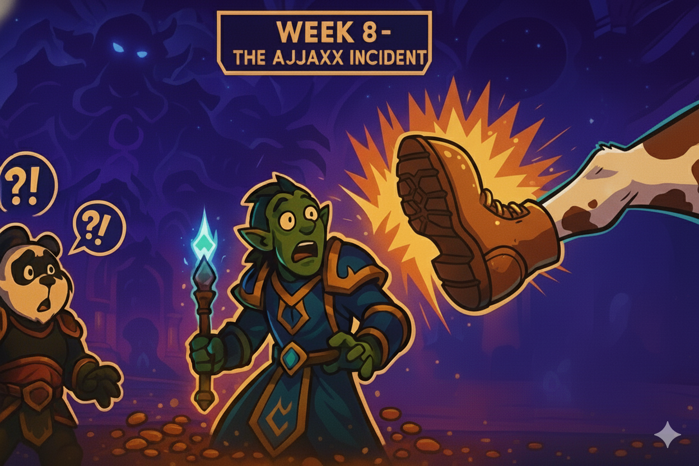

# Week 8 — 10/5 — Beans of Our Gays

Author Credit: Panda
## Cold Open ##

Fresh trial Ajjaxx, Elemental Shaman and alleged friend of Linny, materializes in raid. Panda, suffering from catastrophic memory failure, doesn't recognize his own plus-one. Panic spreads. "Who is this shaman? Did someone sneak in from LFG?" Cham's boot is swift. Ajjaxx's parting message in /say: a declaration of our collective homosexuality. Discord rage-quit commences. We invite him back. Gay jokes flow like lava burst procs for the remainder of the evening. Good times. Guy is definitely banned for life though—we don't deal with that kind of cringe.

## Highlights: 

* The Ajjaxx Incident: Trial shaman joins. Panda forgets his own invite. Cham kicks. Ajjaxx calls everyone gay. Rage quits Discord. We bring him back. Cringe ensues. Banned for life.

* Kez Awakens (Again) :Kez targets Beartastic, dissecting his 1015 raider.io score with surgical precision. "Why do you even play that character?" Beartastic's defense: "I just want to have fun with my friends." This concept confuses Kez. We're certain he's thinking "didn't ask." Probably still upset about Steve Irwin.

* Frumplequeef Supremacy: Most bosses one-shot. Whispers suggest Frumplequeef, the superior Arcane mage to Jayohen, is responsible with impeccable pull lusts. Dimensius falls in three pulls.

* The Polymorph Incident: During Dimensius progression, Frumplequeef Polymorphs himself, becomes a Windwalker Monk, and pushes beans deeper into victory. His sacrifice allows Carndog's bald yet reptilian grasp to encumber the ring from Dimensius, furthering his agenda of acquiring gear but only using it during raid hours.

* Lily's Blessing: Star, now known as Lily, guild crafter extraordinaire, blessed us with miraculous guild bank funding earlier this week. The beans flow. Progress sustained.

* Soul Hunter Spoils: Two mail boots drop. One goes to Fabio. For transmog. As is tradition.

* Araz Performance Report: Araz's balls were slower today. Investigation pending.

* Arithorne's Baby Talk: Arithorne casually drops that he has multiple children spanning multiple relationships. Informs raid his newest newborn is smaller than usual. His other babies are much bigger, apparently. Raid chat processes this information. No one asked, but we all know now.

### Quotes Out of Context
* "Wait, who's the ele shaman?" — Panda, forgetting his own guest list
* "Everyone's gay." — Ajjaxx's parting words in /say
* "Why do you even play that character?"— Kez, to Beartastic
* "I just want to have fun with my friends." — Beartastic, confusing Kez
* "I'm a monk now." — Frumplequeef, post-Polymorph
* "His balls were slower." — Mika for some reason

### Mini-Awards:
* Golden Ladle: Frumplequeef, for superior mage supremacy and tactical Polymorph sacrifice.
* Chili-Con-Carry: Lillie, for guild bank miracles that fuel the bean machine.
* Spilled Beans: Ajjaxx, for the speedrun from trial to lifetime ban.
* Refried Wipes: Kez, for emotional damage inflicted on Beartastic's ilvl.

### Lessons Learned:

* Always remember who you invited to raid.
* Fun with friends is a foreign concept to some.
* Polymorphing yourself into a Windwalker Monk is a legitimate strategy.

### Boss Roast — Dimensius:

Dimensius, the blob of cosmic void energy who forgot to stop at the gym, exists as a purple puddle of poor life choices. His mechanics include: "stand in circles," "don't stand in circles," and "justice beam the wrong person"—looking at you, Jay. His add phase feels like herding cats through a blender. Three pulls. Carndog got his ring. Gear hoarded. Victory claimed.