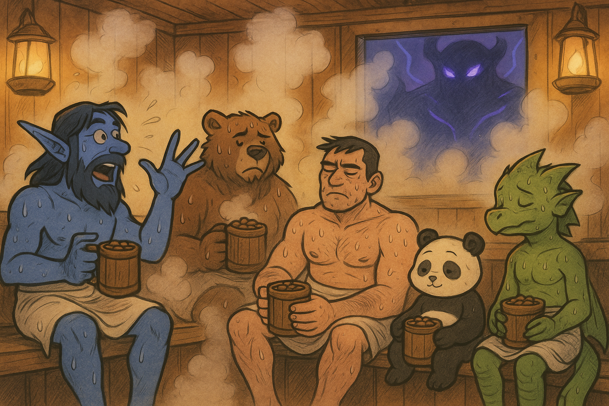

### Week 9 — 10/12 — **Beans in the Steam**

**Episode Banner:**

**Cold Open:**
We start late—because of course we do. **Cole** promises reinforcements: “I’ve got some friends coming.” Moments later, **Riley**, a very small, very undergeared dragon, waddles in like an emotional support pet made of scales. Spirits flicker. Hope remains… tepid.

**Highlights:**

* **Shadobe** takes center stage for storytime, delivering an unsolicited epic about a *Ukrainian bathhouse in New York*. Nobody’s sure what the moral was, but everyone felt a little steamier after.
* **Loot gods** continue their campaign of psychological warfare—everything that drops is either for another class or another timeline.
* The raid’s collective DPS peaks at “sauna-level intensity” before flatlining into wipe number… we lost count.
* **Dimensius** stands tall, undefeated, smugly absorbing our cooldowns and self-esteem alike.
* **Kez** tanks admirably while sweating both literally and metaphorically.
* **Beartastic** barkskins reflexively through every sauna story beat.

**Quotes Out of Context:**

* “Is the bathhouse mechanic single-target or AoE?” — Beartastic
* “This loot table is performance art.” — Kez
* “I’m just here for the beans.” — Panda

**Mini-Awards:**

* **Golden Ladle:** **Riley**, for bravery in low item level.
* **Refried Wipes:** **Everyone**, for dying hot and hydrated.
* **Spilled Beans:** **Shadobe**, for bathhouse monologue of the century.

**Lessons Learned (3 max):**

1. The real buff was the steam we sweated along the way.
2. Loot is temporary, but sauna shame is eternal.
3. Next week: return clean, calm, and maybe—just maybe—victorious.

**TL;DR:**
Late start, cold loot, hot wipes. The Beans failed Dimensius but found enlightenment in the sauna. Next week, they emerge cleansed, hydrated, and ready to reforge their glory.

